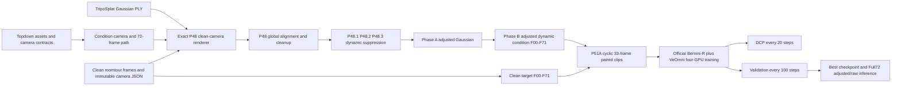

# 架构与数据流

## 不可变合同

- 相机：P48 使用 `video_center_72` 的 OpenCV C2W clean camera JSON，按 F00 到 F71 数字顺序读取。不得修改相机和 clean。
- 训练配对：adjusted condition 与 clean target 仅以同名 F00 到 F71 配对；训练 clip 为 33 帧 cyclic clip。
- Clean 边界：Clean 仅作为训练 target、验证指标和对比板输入。推理 condition 仅能来自 adjusted 或 raw Tripo route。
- Gaussian：调整和动态抑制不允许改变 camera 或把 Clean 像素写入 condition。
- 检查点：只有包含 `P51A_DCP_COMPLETE.json` 的 DCP 可恢复。任何部分 checkpoint 必须归档，不能覆盖或恢复。

## 代码责任划分

| 阶段 | 主要代码 | 关键输出 |
| --- | --- | --- |
| Topdown 到 condition | `local/topdown_condition/01_infinisplat/` | camera payload、72-frame condition、pair manifest |
| Tripo clean-camera 对齐 | `render_tripo_clean_path.py`、`phase_z_*` | P48 aligned condition、全局 similarity transform |
| Tripo 清理 | `p48_1_*`、`p48_2_*`、`p48_3_*` | cleaned Gaussian、dynamic risk 与 opacity weights |
| Adjusted condition | `phase_a_*`、`phase_b_dynamic_adjusted.py` | `condition_adjusted_rgb/F00.png` 到 `F71.png` |
| Bernini paired data | `p51a_build_dataset.py`、`p51a_write_parquet.py` | cyclic clips、official preprocessed parquet |
| 训练与恢复 | `train_bernini_renderer_p51a.py`、`p51a_train_validate_cycles.sh`、`p51a_persistent_guard.sh` | DCP、HF exports、atomic resume |
| 验证与交付 | `p51a_validate_shard.py`、`p51a_finalize.py`、`p51a_posttrain_controller.sh` | 四起点验证、best checkpoint、Full72 对比 |
